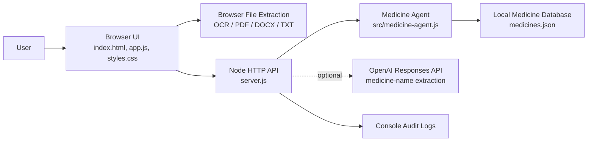
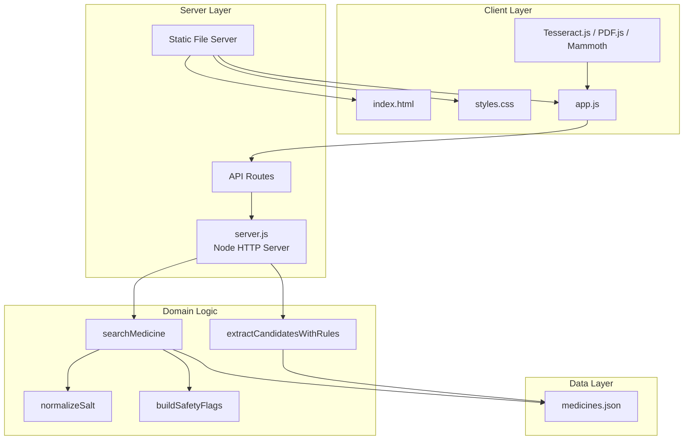
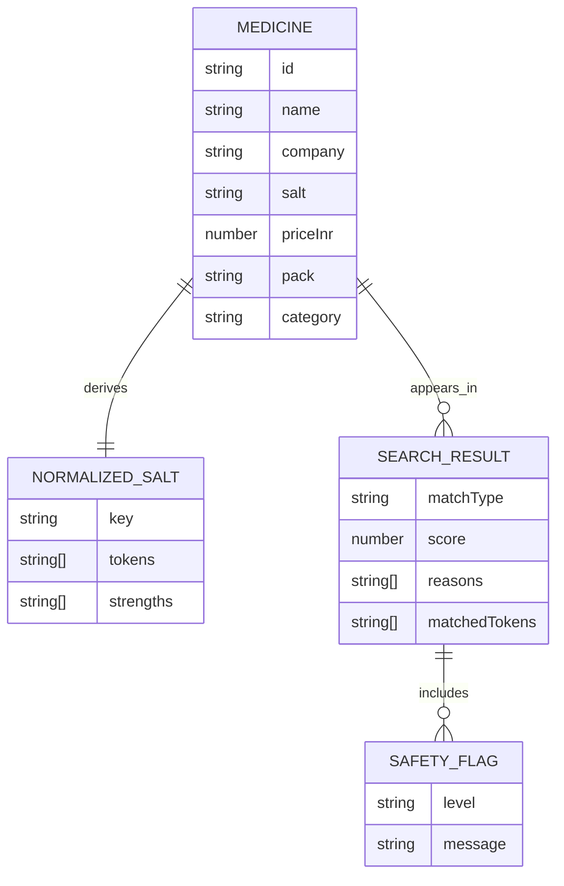
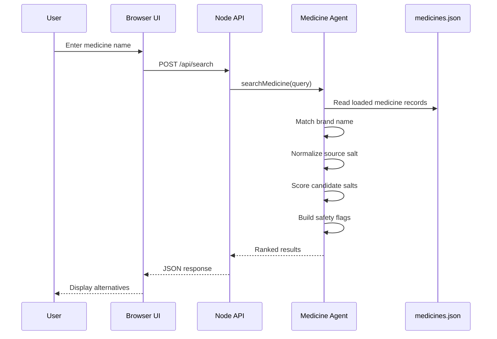
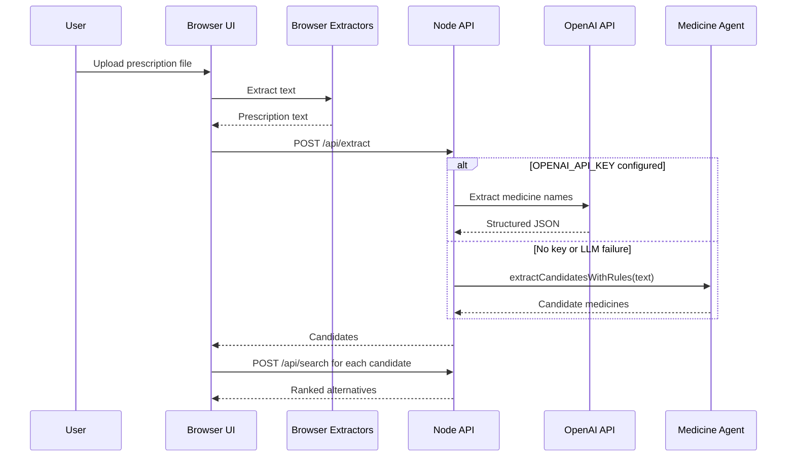
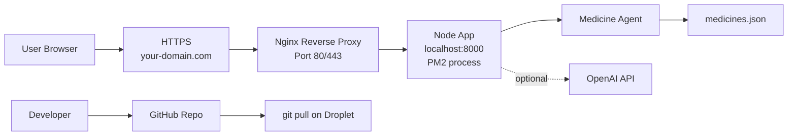
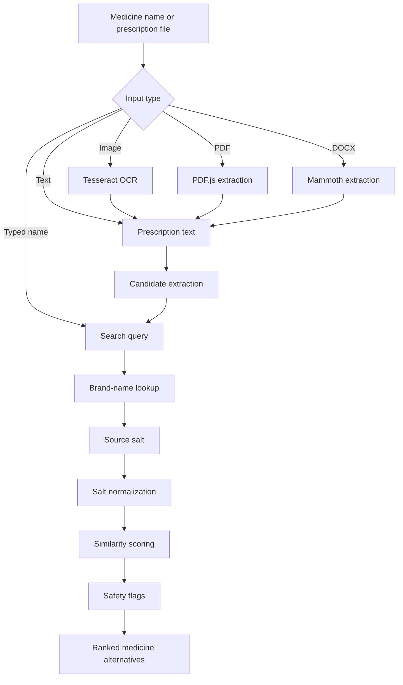

# Axnovus MediSalt AI - Application Handover Document

## 1. Executive Summary

Axnovus MediSalt AI is a web-based medicine salt alternative search application. It allows a user to enter a medicine name manually or extract medicine names from prescription text, images, PDFs, DOCX files, or TXT files. The application resolves the medicine to a known salt composition and returns ranked alternatives from a local medicine database with company name, salt composition, price, pack size, match quality, reasons, and safety flags.

The system intentionally separates AI-assisted extraction from final medicine matching. Optional LLM usage is limited to reading messy prescription/OCR text and identifying likely medicine names. Final salt matching is deterministic, auditable, and implemented in application code.

Current implementation status:

- Functional browser UI.
- Node.js backend API.
- Local JSON medicine database.
- Optional OpenAI extraction path.
- Rule-based fallback extraction.
- Deterministic salt similarity matching.
- Safety flags for partial matches, strength differences, dosage-form differences, antibiotics, and chronic-therapy categories.
- Unit tests for salt normalization and matching behavior.

## 2. Problem Statement

Patients, pharmacists, and healthcare operations teams often need to identify equivalent or lower-cost medicine alternatives. Brand names differ across companies, while the clinically relevant comparison depends on salt composition, strength, release type, route, and dosage form.

The problem is difficult because:

- Prescriptions may contain brand names, spelling variations, or OCR noise.
- Combination medicines include multiple active ingredients.
- Same salt with different strength must not be treated as an exact substitute.
- Substitution risk differs by therapeutic category.
- LLM-only matching is unsafe because it may infer or hallucinate.

Axnovus MediSalt AI addresses this by combining optional AI extraction with deterministic, explainable salt matching.

## 3. Business Value

The application can support:

- Faster medicine alternative discovery.
- Price comparison across brands.
- Pharmacist-assisted substitution workflows.
- Healthcare CRM or pharmacy inventory workflows.
- Prescription digitization workflows.
- Patient support workflows where medicine availability or cost is a concern.
- A foundation for a larger Axnovus healthcare AI operating layer.

Key business benefits:

- Reduces manual lookup effort.
- Improves transparency by showing match reasons.
- Helps avoid unsafe exact-match claims.
- Keeps final medicine equivalence auditable.
- Can be extended with licensed drug databases and pharmacy inventory systems.

## 4. User Personas

### Pharmacist

Needs to quickly compare medicines by salt composition, price, and company while checking whether strength or form differs.

### Clinic Operations Staff

Needs to digitize medicine names from prescriptions and support patient queries about alternatives.

### Healthcare Support Agent

Needs a guided tool to search medicine alternatives without relying on memory or unverified internet results.

### Patient Assistance Coordinator

Needs to identify lower-cost options for prescribed medicines, subject to pharmacist or doctor approval.

### Product/Admin User

Needs visibility into the underlying medicine database, API behavior, and safety limitations before production rollout.

## 5. Features Implemented

### Medicine Search

- Manual medicine name input.
- Brand-name fuzzy matching.
- Salt similarity search.
- Exact, close, and partial match labels.
- Ranked result list.

### Prescription Input

- Image upload with browser OCR using Tesseract.js CDN.
- PDF text extraction using PDF.js CDN.
- DOCX text extraction using Mammoth CDN.
- TXT file reading.
- Manual prescription text paste.

### Extraction

- Backend rule-based medicine candidate extraction.
- Optional OpenAI LLM extraction through `/api/extract`.
- LLM fallback to deterministic extraction on error.
- Browser-side local fallback when backend is unavailable.

### Result Display

- Medicine name.
- Company name.
- Category.
- Salt composition.
- Price in INR.
- Pack size.
- Dosage form.
- Release type.
- Matched salt tokens.
- Match score.
- Match type.
- Match reasons.
- Safety flags.

### Safety Guardrails

- Exact match requires same normalized salt, same strength, same dosage form, and same release type.
- Different strengths are flagged.
- Different dosage forms are flagged.
- Antibiotics require pharmacist/doctor review.
- Chronic therapy categories require patient-specific review.
- Results include a decision-support disclaimer.

### Operational Features

- Health endpoint.
- Medicine database stats endpoint.
- Request IDs.
- Basic audit logging for search and extraction.
- JSON request body size limit.
- Static UI serving from same Node server.
- Node test suite.

## 6. User Journey

### Manual Search Journey

1. User opens the application.
2. User enters a medicine name such as `Augmentin 625`.
3. UI calls `/api/search`.
4. Backend finds the closest brand match.
5. Backend retrieves the source salt.
6. Backend ranks all medicines by salt similarity.
7. UI displays alternatives with exact, close, and partial labels.
8. User reviews safety flags and pricing.

### Prescription Text Journey

1. User opens the `Text` tab.
2. User pastes prescription text.
3. UI calls `/api/extract`.
4. Backend extracts candidate medicine names.
5. UI creates editable detected medicine chips.
6. Each detected medicine is searched through `/api/search`.
7. Results are displayed per detected medicine.

### Prescription File Journey

1. User opens the `Prescription` tab.
2. User uploads an image, PDF, DOCX, or TXT file.
3. Browser extracts text from the file.
4. Extracted text is sent to `/api/extract`.
5. Candidate medicines are searched and displayed.

## 7. Technical Architecture

The application uses a simple monolithic Node.js architecture:

- Browser UI handles interaction and file text extraction.
- Node backend serves static files and JSON APIs.
- Medicine matching logic is isolated in `src/medicine-agent.js`.
- Medicine data is stored in `medicines.json`.
- Optional OpenAI call is used only for medicine-name extraction.

### High-Level Architecture



### Component Diagram



## 8. Technology Stack

### Frontend

- HTML5
- CSS3
- Vanilla JavaScript
- Tesseract.js CDN for image OCR
- PDF.js CDN for PDF text extraction
- Mammoth browser CDN for DOCX text extraction

### Backend

- Node.js
- Native `node:http`
- Native `node:fs/promises`
- Native `node:path`
- Native `node:crypto`

### Data

- JSON file database: `medicines.json`

### AI

- Optional OpenAI Responses API
- Configured by `OPENAI_API_KEY`
- Default model: `gpt-4.1-mini`

### Testing

- Native Node test runner: `node --test`
- Tests located in `test/medicine-agent.test.js`

### Deployment Target

- Ubuntu server or DigitalOcean Droplet
- Node.js runtime
- PM2 process manager recommended
- Nginx reverse proxy recommended
- Certbot/Let's Encrypt recommended for HTTPS

## 9. Database Design

Current database is a JSON array in `medicines.json`.

### Current Medicine Record

```json
{
  "name": "Augmentin 625 Duo",
  "company": "GSK Pharmaceuticals",
  "salt": "Amoxicillin 500 mg + Clavulanic Acid 125 mg",
  "priceInr": 204,
  "pack": "10 tablets",
  "category": "Antibiotic"
}
```

### Derived Runtime Fields

The backend enriches each record at startup:

```js
function enrichMedicine(item) {
  return {
    ...item,
    id: slugify(`${item.name}-${item.company}-${item.salt}`),
    normalizedSalt: normalizeSalt(item.salt),
  };
}
```

### Logical Schema



### Recommended Production Database

For production, move from JSON to PostgreSQL or another managed database.

Suggested tables:

- `medicines`
- `companies`
- `salt_components`
- `medicine_salt_components`
- `prices`
- `audit_events`
- `extraction_events`

## 10. API Design

Base URL:

```text
http://localhost:8000
```

### GET `/api/health`

Returns server health, LLM mode, and medicine database stats.

Response:

```json
{
  "ok": true,
  "requestId": "uuid",
  "llmEnabled": false,
  "stats": {
    "medicines": 61,
    "saltGroups": 39,
    "companies": 25,
    "categories": ["Acidity", "Allergy", "Analgesic"]
  }
}
```

### GET `/api/medicines/stats`

Returns database statistics.

Response:

```json
{
  "medicines": 61,
  "saltGroups": 39,
  "companies": 25,
  "categories": ["Acidity", "Allergy"]
}
```

### POST `/api/search`

Searches medicine alternatives.

Request:

```json
{
  "query": "Augmentin 625",
  "limit": 10
}
```

Response:

```json
{
  "requestId": "uuid",
  "query": "Augmentin 625",
  "source": {
    "medicine": {
      "name": "Augmentin 625 Duo",
      "company": "GSK Pharmaceuticals",
      "salt": "Amoxicillin 500 mg + Clavulanic Acid 125 mg"
    },
    "confidence": 0.88,
    "method": "brand-name"
  },
  "results": [
    {
      "medicine": {
        "name": "Moxikind-CV 625",
        "company": "Mankind Pharma",
        "salt": "Amoxicillin 500 mg + Clavulanic Acid 125 mg",
        "priceInr": 166,
        "pack": "10 tablets",
        "category": "Antibiotic",
        "dosageForm": "tablet",
        "releaseType": "immediate"
      },
      "score": 1,
      "matchType": "exact",
      "reasons": ["Same normalized salt composition."],
      "safetyFlags": [
        {
          "level": "review",
          "message": "Antibiotic substitution should be pharmacist/doctor approved."
        }
      ],
      "matchedTokens": ["acid", "amoxicillin", "clavulanic"]
    }
  ],
  "disclaimer": "Decision support only..."
}
```

### POST `/api/extract`

Extracts likely medicine names from prescription text.

Request:

```json
{
  "text": "Rx\nTab Crocin Advance 500 after food\nTelma 40 OD"
}
```

Response:

```json
{
  "requestId": "uuid",
  "mode": "rules",
  "candidates": [
    {
      "name": "Crocin Advance 500",
      "confidence": 0.96,
      "rawText": "Crocin Advance 500",
      "source": "database"
    }
  ],
  "notes": ["LLM extraction disabled because OPENAI_API_KEY is not set."]
}
```

### API Sequence Diagram



### Extraction Sequence Diagram



## 11. Security Considerations

### Current Controls

- Request body limit: `512 KB`.
- `X-Content-Type-Options: nosniff` response header.
- Path traversal guard in static file serving.
- Optional LLM extraction does not perform final medical matching.
- Raw prescription text is not intentionally persisted.
- Request IDs are included in API responses.

### Current Risks

- No authentication.
- No authorization.
- No rate limiting.
- No HTTPS in local development.
- Public static serving includes all project files under the root path if requested.
- Console logs may include search query names.
- CDN dependencies are loaded from third-party URLs.
- Local JSON database is not a licensed production drug source.

### Production Recommendations

- Add authentication.
- Add role-based authorization.
- Add HTTPS-only access.
- Add rate limiting.
- Move static assets into a dedicated `public/` directory.
- Restrict serving of `.env`, logs, source files, tests, and markdown docs.
- Avoid logging raw prescription text.
- Add audit logging with PHI minimization.
- Add Content Security Policy.
- Pin and self-host frontend dependencies where possible.
- Use a licensed drug database.

## 12. Deployment Architecture

Recommended DigitalOcean deployment:

- Ubuntu Droplet.
- Node.js application running with PM2.
- Nginx reverse proxy.
- Certbot for HTTPS.
- GitHub private repository for source control.
- `.env` created only on the server.

### Deployment Diagram



### Deployment Commands

```bash
apt update
apt install -y git curl nginx
curl -fsSL https://deb.nodesource.com/setup_lts.x | bash -
apt install -y nodejs
npm install pm2@latest -g
git clone git@github.com:contactaxnovus-ai/axnovus-medisalt-ai.git
cd axnovus-medisalt-ai
pm2 start server.js --name axnovus-medisalt-ai
pm2 save
pm2 startup
```

### Nginx Reverse Proxy

```nginx
server {
    listen 80;
    server_name yourdomain.com www.yourdomain.com;

    location / {
        proxy_pass http://localhost:8000;
        proxy_http_version 1.1;
        proxy_set_header Upgrade $http_upgrade;
        proxy_set_header Connection "upgrade";
        proxy_set_header Host $host;
        proxy_set_header X-Real-IP $remote_addr;
        proxy_set_header X-Forwarded-For $proxy_add_x_forwarded_for;
        proxy_cache_bypass $http_upgrade;
    }
}
```

## 13. Challenges Solved

### Safe Use Of AI

The system does not rely on an LLM for final medicine equivalence. LLM usage is limited to extraction, while deterministic matching makes final search behavior reproducible.

### Combination Salt Matching

Combination salts such as `Amoxicillin 500 mg + Clavulanic Acid 125 mg` are tokenized so candidates can be compared by active ingredient overlap.

### Strength Differences

Different strengths are not hidden, but they are downgraded and flagged. Example: `Paracetamol 500 mg` and `Paracetamol 650 mg` are close, not exact.

### Prescription Noise

Rule-based extraction removes common prescription directions like `tab`, `OD`, `after food`, and similar terms.

### Backend Unavailability

The browser app includes a local fallback. If the API is unavailable, it can search from `medicines.json` directly and show `Local mode`.

### UI Simplification

Earlier explanatory right-panel content was removed from the application UI and moved into documentation so the app looks like a working healthcare tool rather than an AI demo.

## 14. AI/Codex Contributions

Codex contributed:

- Initial application scaffolding.
- Axnovus-themed UI.
- Backend API design.
- Salt normalization logic.
- Deterministic similarity scoring.
- Safety flag logic.
- Optional LLM extraction route.
- Browser-side local fallback.
- Test suite.
- README and system notes.
- Git/GitHub deployment guidance.
- This handover document.

Human/Product decisions included:

- Application direction and business goal.
- Axnovus branding requirement.
- UI simplification requirement.
- GitHub/DigitalOcean deployment target.

## 15. Future Enhancements

### Data

- Replace `medicines.json` with a licensed medicine database.
- Add expiry-aware price feeds.
- Add manufacturer verification.
- Add region-specific availability.
- Add drug form, route, and schedule metadata.

### Product

- Add user login.
- Add pharmacist approval workflow.
- Add patient-friendly alternative explanation.
- Add exportable search report.
- Add prescription history.
- Add inventory-aware alternatives.

### AI

- Add handwriting OCR workflow.
- Add spelling correction for medicine brands.
- Add confidence scoring for extracted prescription candidates.
- Add human-in-the-loop extraction review.
- Add structured prompt evaluation tests.

### Engineering

- Move backend to Express/Fastify if route complexity grows.
- Move static assets to `public/`.
- Add PostgreSQL.
- Add CI/CD.
- Add Dockerfile.
- Add PM2 ecosystem file.
- Add observability.
- Add rate limiting.
- Add auth middleware.
- Add CSP headers.

## Complete Folder Structure

```text
create-an-ai-agent-which-can/
├── .env.example
├── HANDOVER.md
├── README.md
├── SYSTEM_NOTES.md
├── app.js
├── index.html
├── medicines.json
├── package.json
├── server.js
├── styles.css
├── src/
│   └── medicine-agent.js
└── test/
    └── medicine-agent.test.js
```

Note: runtime log files such as `server.out.log` and `server.err.log` should not be committed.

## Important Code Snippets

### Server Startup

```js
async function start() {
  await loadMedicines(path.join(__dirname, "medicines.json"));

  const server = http.createServer(async (req, res) => {
    const requestId = req.headers["x-request-id"] || randomUUID();
    res.setHeader("X-Request-Id", requestId);
    res.setHeader("X-Content-Type-Options", "nosniff");
    // route handling
  });

  server.listen(PORT, () => {
    console.log(`Axnovus MediSalt AI running at http://localhost:${PORT}`);
  });
}
```

### Search API Route

```js
if (req.url === "/api/search" && req.method === "POST") {
  const body = await readJson(req);
  const query = String(body.query || "").trim();
  const limit = Math.min(Number(body.limit || 10), 25);
  if (!query) return sendJson(res, 400, { error: "query is required", requestId });
  const result = searchMedicine(query, { limit });
  return sendJson(res, 200, { requestId, ...result });
}
```

### Salt Normalization

```js
function normalizeSalt(salt) {
  const strengthMatches = [...salt.matchAll(/(\d+\.?\d*)\s*(mg|mcg|gm|g|ml|iu|%)/gi)]
    .map((match) => `${match[1]}${match[2].toLowerCase()}`);

  const tokens = salt
    .toLowerCase()
    .replace(/\d+\.?\d*\s*(mg|mcg|gm|g|ml|iu|%)/g, " ")
    .replace(/\b(ip|bp|usp|tablet|capsule|syrup|injection|mg|mcg|gm|g|ml)\b/g, " ")
    .replace(/[()+,]/g, " ")
    .replace(/\s+/g, " ")
    .trim()
    .split(/[\s/+]+/)
    .map((token) => token.trim())
    .filter((token) => token.length > 1)
    .sort();

  return {
    tokens,
    key: [...new Set(tokens)].join("|"),
    strengths: strengthMatches,
  };
}
```

### Similarity Scoring

```js
function saltSimilarity(a, b) {
  const left = normalizeSalt(a);
  const right = normalizeSalt(b);
  if (!left.tokens.length || !right.tokens.length) return 0;
  const intersection = left.tokens.filter((token) => right.tokens.includes(token)).length;
  const union = new Set([...left.tokens, ...right.tokens]).size;
  const jaccard = intersection / union;
  const strengthPenalty =
    left.strengths.length &&
    right.strengths.length &&
    left.strengths.join("|") !== right.strengths.join("|")
      ? 0.12
      : 0;
  return Math.max(0, jaccard - strengthPenalty);
}
```

### Safety Flags

```js
function buildSafetyFlags(sourceMedicine, candidate, score) {
  const flags = [];
  if (!sourceMedicine) {
    flags.push({ level: "review", message: "Source medicine not confidently identified." });
    return flags;
  }
  if (score < 0.72) flags.push({ level: "caution", message: "Partial salt match only." });
  if (normalizeSalt(sourceMedicine.salt).strengths.join("|") !== normalizeSalt(candidate.salt).strengths.join("|")) {
    flags.push({ level: "caution", message: "Different strength." });
  }
  if (/antibiotic/i.test(sourceMedicine.category)) {
    flags.push({ level: "review", message: "Antibiotic substitution should be pharmacist/doctor approved." });
  }
  return flags;
}
```

### Optional LLM Extraction

```js
async function extractMedicineCandidates(text) {
  if (!process.env.OPENAI_API_KEY) {
    return {
      mode: "rules",
      candidates: extractCandidatesWithRules(text),
      notes: ["LLM extraction disabled because OPENAI_API_KEY is not set."],
    };
  }

  try {
    return await extractCandidatesWithLlm(text);
  } catch (error) {
    return {
      mode: "rules_fallback",
      candidates: extractCandidatesWithRules(text),
      notes: [`LLM extraction failed; used deterministic fallback. ${error.message}`],
    };
  }
}
```

## Data Flow Diagram



## README

```markdown
# Axnovus MediSalt AI

Axnovus MediSalt AI is a medicine alternative search application. It accepts a medicine name or prescription text, identifies likely medicine names, resolves a source brand to its salt composition, and returns ranked alternatives from a local medicine database.

## Run

\`\`\`powershell
npm start
\`\`\`

Open:

\`\`\`text
http://localhost:8000
\`\`\`

## Optional LLM Extraction

\`\`\`powershell
$env:OPENAI_API_KEY="your_api_key"
$env:OPENAI_MODEL="gpt-4.1-mini"
npm start
\`\`\`

Without `OPENAI_API_KEY`, extraction uses deterministic rules.

## API

- `GET /api/health`
- `GET /api/medicines/stats`
- `POST /api/extract`
- `POST /api/search`

## Test

\`\`\`powershell
node --test
\`\`\`

## Safety

This is decision support, not a prescribing tool. Always confirm salt, strength, route, dosage form, release type, contraindications, allergies, and patient-specific risks with a licensed clinician or pharmacist.
\`\`\`
